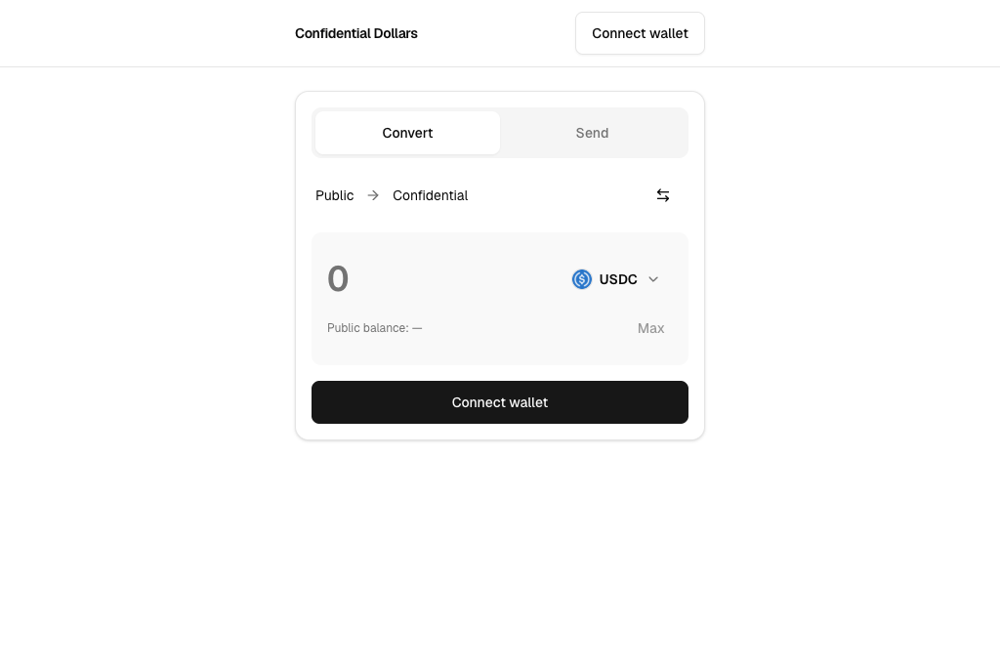

# Confidential stablecoin swap

A local prototype for converting USDC, USDT, and CASH into confidential tokens and back. Built with Solana Token Wrap and native Token-2022 confidential transfers.

Runs on Surfpool with copies of mainnet mints. All transactions stay local.



## How it works

1. Converting holds the original tokens in escrow and mints an equal amount of wrapped tokens. The app deposits those into your confidential balance.
2. Sending uses native Token-2022 confidential transfers. The recipient adds incoming funds to their spendable balance.
3. Converting back withdraws from the confidential balance, burns the wrapped tokens, and releases the original tokens from escrow.

Each asset has its own wrapper. You can redeem wrapped USDC for USDC, not USDT or CASH. Transfer amounts and confidential balances are encrypted; addresses, timing, deposits, and redemptions remain public.

## Setup

Requires Node.js 24+, pnpm 10.15.0, Rust, Solana CLI 4.1.0 with `cargo build-sbf`, and Surfpool 1.5.0. The build pins SBF platform tools to v1.57.

```sh
git clone https://github.com/arihantbansal/confidential-stablecoin-swap.git
cd confidential-stablecoin-swap
pnpm install
pnpm local:build
pnpm local:start
```

Leave Surfpool running. In a second terminal:

```sh
pnpm local:setup
pnpm dev
```

Open http://127.0.0.1:5173. Surfpool serves RPC on port 8899 and WebSocket on 8900.

`local:setup` deploys the wrapper locally and prepares the mint copies. It stores local keys in `.keys/` and deployment addresses in `runtime/local.json`. Both are gitignored.

## Use

1. Connect a Solana wallet or choose **Use a test wallet**.
2. Choose an asset beside the amount field.
3. Click your wallet address, then **Get USDC**, **Get USDT**, or **Get CASH** to top up that asset to 100. This also adds SOL when needed. Test wallets start funded for the selected asset.
4. Use **Convert** to move between public and confidential balances. Flip the direction to convert back. Use **Send** to transfer confidential funds.

Incoming funds appear above the form, grouped by asset. Choose **Add to balance** to make them spendable. Amounts appear after you unlock the asset's confidential keys.

If confirmation is unknown, choose **Check status**. New transactions stay blocked until the outcome is known, even after disconnect. Keep the page open: receipts live in memory, and a timeout does not mean the transaction failed.

Test wallets also live in page memory. Reloading or disconnecting deletes them.

## Checks

```sh
pnpm typecheck
pnpm lint
pnpm test
pnpm build
```

With Surfpool running, replenish the fixtures before each roundtrip:

```sh
pnpm local:setup
pnpm local:roundtrip
bash scripts/test-wrapper.sh
```

The roundtrip wraps, deposits, sends, withdraws, and unwraps all three assets, then checks token accounting. The wrapper script runs the upstream Rust tests.

## Limits

- This project has not been independently audited or formally verified. It is a local prototype.
- USDC and USDT mint copies retain issuer freeze controls. CASH retains its permanent delegate. The wrappers also retain freeze controls.
- Local funding uses a development-only cheatcode endpoint on the localhost app.

## License

[MIT](LICENSE). Token Wrap is vendored from [commit cc01d39](https://github.com/solana-program/token-wrap/tree/cc01d3988fb300628ee4d04f4af93d16c8d56732), with the program ID changed for local deployment. It retains its [upstream license](vendor/token-wrap/LICENSE). Geist uses the [SIL Open Font License](web/public/fonts/Geist-LICENSE.txt). [Token logo sources](web/src/lib/token-icons.ts) are recorded in the code.
