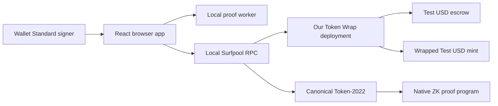

# Build a native confidential-token app with Surfpool

## Implementation status

The local wrapper is compiled and deployed on Surfpool. Its upstream test suite passes (114 passed, one ignored). A real native confidential round trip passes with zero final escrow and wrapped supply. The browser test-wallet flow now passes conversion, confidential send, receipt acceptance, and redemption. Encrypted export/import preserves the signer identity and supports re-export. Wallet-extension testing and moving browser proof work off the UI thread remain. The sections below retain the design and acceptance criteria; passing protocol tests does not imply all UI criteria are complete.

## Goal and scope

Deliver a local web app that lets two independent users obtain test dollars, wrap them, hold an encrypted balance, send a confidential payment, and redeem back to test dollars. Use only native Token-2022 confidential transfers for privacy.

Start with one self-issued legacy SPL mint named Test USD, with six decimals. Its matching Token-2022 wrapper is Wrapped Test USD. Neither represents real USDC or a claim on dollars. A controlled mint removes issuer approval and faucet dependencies from the first experiment.

Later, add separate Test USDT and Test CASH inputs if needed. Each underlying mint has its own wrapper. A single output backed by Test USD would require a separate conversion step. Do not fabricate Jupiter quotes or assume local Surfpool stablecoin liquidity exists. A demo conversion fixture must be visibly identified and excluded from reserve accounting claims.

## Architecture



The wrapper holds collateral in an associated token account controlled by a program-derived authority. It mints the public wrapped balance when collateral arrives and burns it on redemption. Token-2022 handles encrypted balances and transfers. The client creates proofs, submits transactions, decrypts its own balances, and resumes interrupted operations.

Use the upstream wrapper without economic or cryptographic changes. Deployment under a new program ID is a real source/configuration change: replace the declared ID and all generated-client defaults consistently, regenerate as necessary, and check every PDA against the new ID. Do not assume a deployment CLI flag fixes hard-coded `id()` derivations.

Keep the confidential mint defaults: automatic approval, no auditor, and no confidential configuration authority. Keep ordinary mint/burn and public aggregate supply. Do not add confidential mint/burn, transfer fees, hooks, yield, or custom freeze behavior in the initial experiment.

For Test USD, use no freeze authority and retain a dedicated local-only mint authority for test issuance. Mint authority for the wrapped asset must remain the wrapper PDA, not a personal key.

## Tool choices

| Layer | Proposed choice | Reason and validation |
| --- | --- | --- |
| Browser | React + TypeScript + Vite | A client app needs no server rendering. Pin compatible stable releases at implementation. |
| UI | shadcn/ui + Tailwind CSS + custom semantic theme | User-selected components; style the product rather than ship the default preset. |
| Local network | Surfpool CLI and SDK | Real transactions and native proof verification on a resettable local Surfnet. |
| Solana integration | `@solana/kit`, `@solana/react`, wallet plugin using Wallet Standard | Current official direction; check published peer dependencies together. |
| Program clients | Generated `@solana-program/*` clients | Typed instruction builders. Explicitly set our wrapper program address. |
| Onchain wrapper | Pinned SPL Token Wrap Rust source | Preserve existing accounting and tests. No Anchor or Pinocchio rewrite. |
| Confidential proofs | `@solana/zk-sdk/bundler` and `@solana-program/token-2022/confidential` | Official proof and transaction-plan path first; verify browser exports and worker integration before writing an adapter. |
| JavaScript tooling | Node 24 + pnpm | Already installed. Pin project versions and preserve upstream's package-manager requirements. |
| Checks | Upstream Rust tests, focused TypeScript tests, browser end-to-end tests | Test money lifecycle, recovery, and failed operations. |

Do not install dependencies during this planning task. At implementation, approve the concrete dependency/toolchain additions under the working agreement. Select the newest compatible stable set; do not mix package versions merely because each is newest.

## Phase 1: establish a compatible native transfer stack

1. Fetch the pinned upstream wrapper and sample into ignored working directories. Inspect any applicable repository instructions before changes.
2. Reconcile the wrapper's Token-2022 11 / Solana 4.1 dependencies with the sample's Token-2022 10 / ZK SDK 6.0.1 proof path. Record the chosen versions and lockfiles.
3. Build with the upstream-pinned Rust compiler and compatible SBF tools in an isolated project environment. Preserve the user's global Solana configuration.
4. Run upstream program tests. Inspect the difference from the latest listed audit revision and document relevant changes.
5. Run valid and deliberately invalid proofs through Surfpool's native ZK ElGamal verifier using fresh identities. Valid proofs must pass and invalid proofs must fail.

Exit: reproducible build, passing relevant upstream tests, and proof execution validated in the pinned Surfpool runtime. No public-network test is required. Local success establishes behavior in this runtime, not public-network deployment parity.

## Phase 2: deploy the wrapper and prove redemption

1. Create separate disposable local Surfpool payer, program, test-mint authority, and two user identities. Keep secret files outside browser-served directories and git.
2. Restrict application and deployment RPC URLs to the assigned loopback endpoint. Check Surfpool identity and the local deployment manifest before signing. A genesis hash alone is insufficient for a fork. Reject remote transaction destinations.
3. Fund disposable local identities with Surfpool startup airdrops or funding cheatcodes. Create test collateral through normal mint instructions. No public faucet is needed.
4. Build for our program ID, run tests again for ID changes, and deploy only the wrapper to local Surfpool. Use the actual Token-2022 program and Surfpool native ZK verifier; record binary and runtime versions.
5. Create Test USD, create its wrapped mint and escrow, and record mint owners, decimals, extensions, and authorities.
6. Complete this scenario: mint 100 Test USD to A, wrap 100, confidential-deposit 100, apply pending, send 30 to B, apply B's pending balance, withdraw and unwrap B's 30, then redeem A's remaining 70.
7. Check public escrow and total wrapped supply after each collateral change. End with zero wrapped supply and zero escrow balance in this isolated scenario.
8. Check source hash, build hash, deployed bytes, deployment slot, program ID, and upgrade authority. Verification means a reproducible source-to-deployment match, not a safety certificate.

Retain a dedicated local Surfpool upgrade authority for iteration. If testing immutable deployment behavior later, create a separate final instance; do not irreversibly lock the only experimental deployment.

Exit: publish a public-only deployment manifest and transaction signatures with successful A-to-B redemption. Keep program state, version evidence, and signatures reproducible. No secret keys or decrypted private activity in public build logs.

## Phase 3: prove browser cryptography and recovery

Browser key recovery and wallet compatibility remain the largest implementation uncertainties. Current official examples expose a WASM-backed SDK, reducing the need for custom proof plumbing. Published package/export compatibility still requires testing.

First exercise the official `@solana/zk-sdk/bundler` exports and Token-2022 confidential instruction-plan helpers from the current Solana examples. The examples include Node file signers, so replace those with Wallet Standard for the browser. Only build a small adapter around Rust cryptography if the official browser path has a demonstrated gap. Validate WASM loading, browser randomness, serialization, proof format, and memory use. Generate proofs in a Web Worker so the UI remains responsive. Measure preparation time on desktop Chrome and Safari before setting a performance budget.

Do not use the sample's server-held keypairs as the app's custody model. A local Rust command-line proof harness is acceptable for Phase 2, but a hosted service receiving plaintext balances or user keys is outside the design.

Choose and test the encryption-key recovery scheme before deposits. Wallet signatures are possible key material only if the wallet supports the exact message and produces stable signatures across sessions and devices. Do not assume all wallets do. Never request a wallet seed phrase.

Prefer an upstream-supported derivation when compatible. If persistent independent encryption keys are necessary, provide encrypted export/import with an explicit recovery credential and verify restoration. Any new KDF/encryption composition needs review rather than improvisation. A fresh browser must recover a funded account and spend it. Validate the recovered ElGamal public key against the onchain account before allowing new deposits.

Keep plaintext keys out of localStorage, analytics, network logs, and service APIs. Clear in-memory state on disconnect; persistence stores only encrypted material. Account and network switching must invalidate decrypted state and pending work.

Exit: a fresh browser restores user B's encryption keys, decrypts the balance, generates a valid proof, and redeems without access to the original browser profile. If WASM support fails, revisit feasibility before promising a browser-only product.

## Phase 4: implement the UI

Use one page with a persistent `Local · Test tokens only` indicator, wallet connection, balance, and three actions: Convert, Send, Withdraw. Use neutral surfaces, readable type, visible focus states, and inline errors. Never represent sample values as live balances.

Convert displays Test USD input and expected wrapped output. The receive summary names Wrapped Test USD and distinguishes network costs from token amounts. A separate test-token action opens instructions for obtaining local test funds; it does not expose mint-authority keys in the browser. First iteration uses CLI-issued test tokens. A public faucet service is outside this local build.

Send accepts a recipient wallet and amount. Check whether the recipient's token account is configured and approved for confidentiality. An unconfigured recipient must open the app and prepare its own account; do not send a public payment as an invisible fallback. Apply pending credits before spending when needed.

Withdraw converts confidential balance to public wrapped balance and then unwraps. Explain that the withdrawal amount becomes public. Offer retry when only the confidential withdrawal completed.

Show `Preparing account`, `Preparing proof`, `Awaiting approval`, `Submitted`, and `Confirmed` as real observed states. One UI action may require multiple transactions. Do not promise a single approval until tested.

On reload, reconcile onchain state and known signatures before resubmitting. A timeout is not a failed transaction. Expired proofs or changed balances require regeneration. Serialize operations per token account and coordinate multiple tabs. Close temporary proof/context accounts when permitted and recover their rent without abandoning resumable work.

Balance display distinguishes available, incoming pending, and public amounts. Missing decryption keys display `Unlock balance`, never zero. Use integer base units with six-decimal parsing throughout. Reject excess precision, negative amounts, and unsafe numeric conversion.

Exit: two independent wallets complete the lifecycle through the app, including a refresh between steps and recovery from a rejected signature.

## Phase 5: focused checks and handoff

- Reserve invariant: total collateral is at least wrapped supply for the supported no-fee mint. Equality holds in controlled tests; direct collateral donations can make reserve larger.
- Reject wrong mint, escrow, authority, token program, and signer. Test over-redemption, insufficient funds, malformed proofs, and stale proof contexts.
- Verify failed wrap/unwrap transactions do not partially mutate collateral or supply.
- Test repeated clicks, two tabs, incoming transfers during proof preparation, expired blockhash, RPC timeout after submission, and retry after confirmation.
- Test key restoration, wrong recovery credentials, wallet switching, and unsupported recipient setup.
- Check what a public RPC observer actually sees: no plaintext confidential transfer amount, while accounts and entry/exit remain public.
- Test keyboard-only use, mobile layout, loading states, and screen-reader error announcements.
- Disable transaction actions when the local Surfpool deployment manifest is missing or cluster identity differs.

Deliver a local run command, local Surfpool setup/runbook, public manifest, dependency pins, a reproducible two-user test, and known limitations. Run upstream tests with their repository commands; add app checks after the implementation exists. Do not invent passing tests in this planning repository.

## Proposed code layout

Create these only as implementation needs them:

- `web/`: Vite app, transaction flow, wallet connection, UI.
- `web/src/proofs/`: official SDK worker integration. Add a Rust adapter only if a verified gap requires it.
- `vendor/token-wrap/`: pinned source, upstream license, provenance, and explicit deployment-ID patch.
- `scripts/`: local Surfpool setup and lifecycle checks.
- `deployments/local.json`: public addresses, hashes, and versions.

No application backend, hosted database, monorepo task runner, or new onchain routing program is required for the first milestone.

## Effort and decisions

Planning estimate for an experienced Solana engineer: 2–4 days for dependency reconciliation and local Surfpool lifecycle, 3–7 days for browser proofs/recovery, and 3–5 days for the app and failure handling. These are estimates, not commitments; proof compatibility can dominate the schedule.

First implementation task: resolve the dependency set, deploy the wrapper with test collateral, and make the two-user lifecycle pass. Final UI styling follows evidence that users can recover and redeem.

## Surfpool workflow

Use installed Surfpool 1.5.0 as the initial candidate, then pin the version that passes the proof smoke test. Its CLI supports explicit ports, snapshots, runbooks, and offline operation. Do not silently enable every feature or skip signature/blockhash verification.

Begin with a local fork using a remote network only as a read-only source of program/account data. All deployment and wallet transactions target loopback. This does not test on or deploy to the remote network. Solana's current confidential-transfer docs explicitly identify mainnet-forking Surfpool as a supported local approach.

Development command, checked against the installed CLI help, to be run from an ignored working directory before runbooks exist:

```sh
surfpool start --network mainnet --host 127.0.0.1 --port 8899 --ws-port 8900 --no-deploy --airdrop-amount 0
```

This command has not been launched during planning. Use isolated ports if occupied. Disable automatic airdrops to avoid reading the user's default wallet; supply disposable project identities explicitly when seeding.

After obtaining a working runtime/program combination, capture the required accounts with Surfpool snapshots and pin program hashes and feature configuration. Target offline repeatability with `--offline --snapshot`; verify native feature parity rather than assuming an account snapshot captures all runtime behavior. Never claim the first live fork is deterministic.

Keep `txtx.yml` and a small local deployment runbook for repeatable build/deploy outputs. Use the Surfpool SDK for isolated integration-test instances where its published version is compatible. Preserve upstream Mollusk tests for focused program checks. Use Vitest for client parsing/state transitions and Playwright for the browser lifecycle with two isolated users. Do not add an orchestration framework on top.

Cheatcodes are for initial SOL funding and explicitly marked failure fixtures. The successful collateral lifecycle must use real mint, wrap, confidential deposit, transfer, withdraw, and unwrap instructions. Never inject encrypted balances or bypass proof verification to make the test pass.

A clean reset must recreate the local deployment manifest and invalidate prior UI transaction state. Keep two workflows: persistent local state for manual UI testing, fresh instances for automated tests. Surfpool Studio supplies local transaction inspection; its local SQLite state is development infrastructure, not an application database.

Devnet is optional future portability work and is not an acceptance requirement. No public-network writes are part of this plan.

## shadcn/ui theme

Use shadcn/ui components with Tailwind and CSS-variable semantic tokens. Copy only Button, Input, Label/Field, Dialog, Select, Tabs, Tooltip, Alert, and progress/status components needed by actual flows. Preserve accessible behavior when styling.

The visual direction is a restrained money utility: off-white background, white transaction surface, charcoal text and primary buttons, subdued gray borders, and green reserved for confirmed success. Avoid gradients, decorative charts, oversized pill controls, and a dashboard sidebar. Use a system sans-serif stack initially, tabular figures for balances, 44-pixel primary controls, and a compact amount-focused panel that fits mobile screens.

Define light/dark tokens for background, foreground, card, primary, secondary, muted, border, input, ring, destructive, success, and warning. Use OKLCH values in the implementation, verify contrast for each actual foreground/background pairing, and honor reduced motion. Tune spacing, radius, input treatments, dialogs, and status text together. A theme is more than changing the primary color.

Place component source in `web/src/components/ui`, product flows in feature components, and semantic tokens in the app stylesheet. Keep cryptographic/accounting logic outside styled components. Exact colors and optical spacing are finalized by inspecting the rendered UI, not marked complete from this plan.
